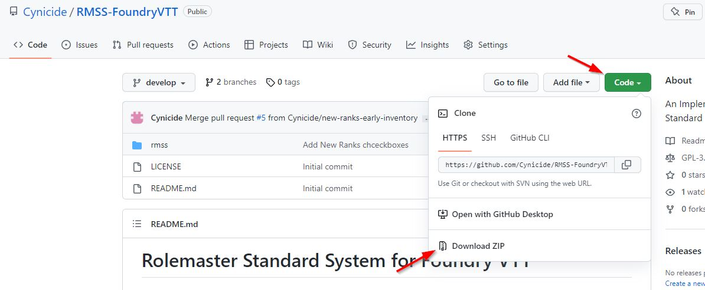
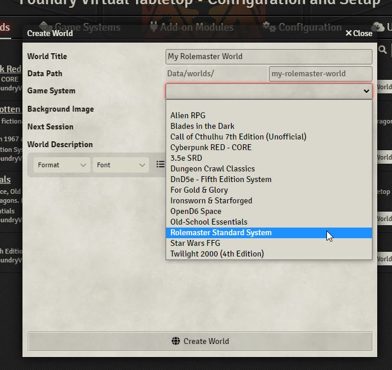

# Installing the Rolemaster FoundryVTT System

## Download the System
As the system has not been officially released yet you won't be able to download it via the in game System browser. To install it you must download the System from the github repository and extract it to the right place in your FoundryVTT Data Directory.

Go to https://github.com/Cynicide/RMSS-FoundryVTT and click the green "Code" button from there click "Download Zip".

## Extract and install the System
Using your favorite ZIP extractor (or Windows Explorer if you have none) you must find and extract the "rmss" directory and place it in the "systems" directory in your FoundryVTT Data Directory. As you are free to place this folder anywhere you want I can't tell you where it is. It's the same folder your Worlds go to when you create them in Foundry.

## Checking you have installed properly
If you have installed the folder properly you should see Rolemaster under the Systems tab when you start Foundry.

## Create a World
When you create a world you can now select Rolemaster Standard System from the System dropdown.
