# Rolemaster Standard System for Foundry VTT Usage

## Understanding Foundry Data
In Foundry VTT characters, NPC's and Creatures are called Actors and almost everything else is referred to as an Item. As a result of this things in Rolemaster that you would associate with Characters like Skills and Skill Categories are actually items. 

## Creating a Character
To create a character click on the Actor tab and click "Create Actor". You can choose between an NPC and a Character, however the NPC is unfinished at this point.

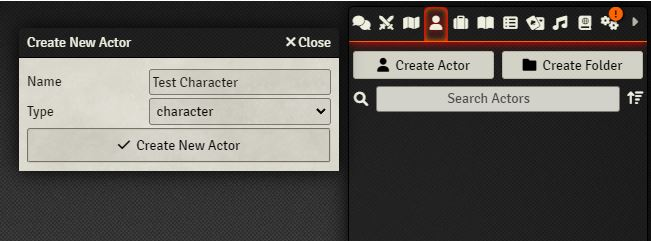

Once you have create your Character you can view the character sheet.

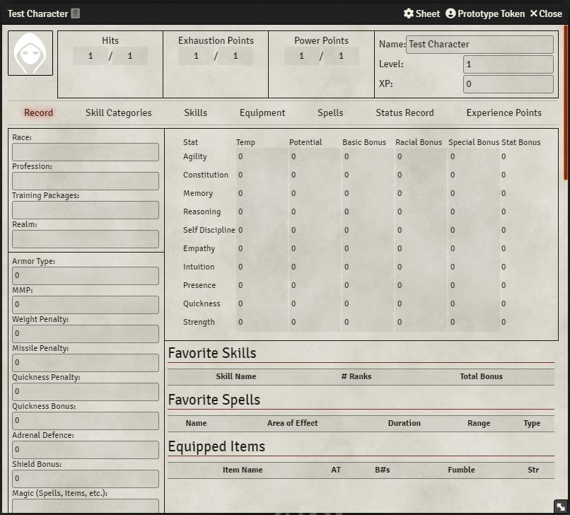

From here you can start filling out fields. Most fields are cosmetic at this point however as you start filling out your stats you will notice the Stat Bonus is auto calculated and Foundry will also attempt to calculate your Resistance Rolls (Racial Bonuses are not supported yet).

Skill Categories and Skills are considered Items by Foundry, see the following section.

## Understanding Items Types
When you create an item you will see the following drop down:

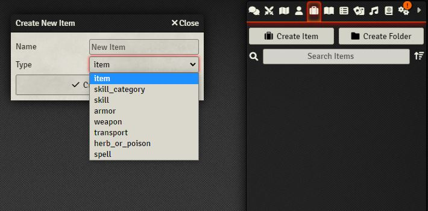

The items you can create are as follows:

 - Skill Category
 - Skill
 - Spell
 - Item
 - Armor
 - Weapon
 - Transport (Not complete)
 - Herb or Poison

 Every item on this list can be dragged onto the character sheet and added to a character. Rather than making an item for each character, consider building a library of items that you can drag on to any character you want.

 ## Creating a Skill Category
When you create a Skill Category you can set the three dropdowns at the top to mark a stat as being applicable to this skill category. After you have done this Foundry will attempt to auto calculate the Stat Bonus when the Skill Category has been dragged onto a character sheet. 

As you fill out the other fields Foundry will attempt to calculate the Total Bonus for this Skill Category.

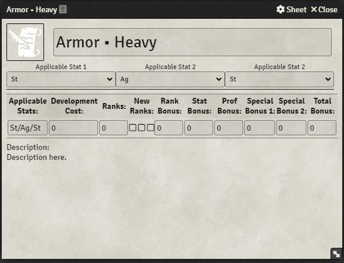

If you click on the Compendiums Tab you will find a compendium with the skill categories from the character sheet ready for you to use.

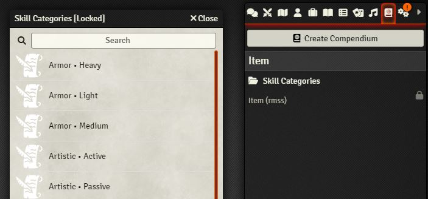

## Dragging a Skill Category onto your Character Sheet
If you drag a skill category onto your character sheet that has the Applicable Stats set you can see that Foundry will apply the appropriate Stat Bonus to the Skill Category. Things like Ranks, Rank Bonuses, Profession Bonuses and Special Bonuses are manually entered but will be taken into account when the Total bonus is calculated.

If you make a mistake selecting the applicable stats you can just click the pencil icon to edit it.

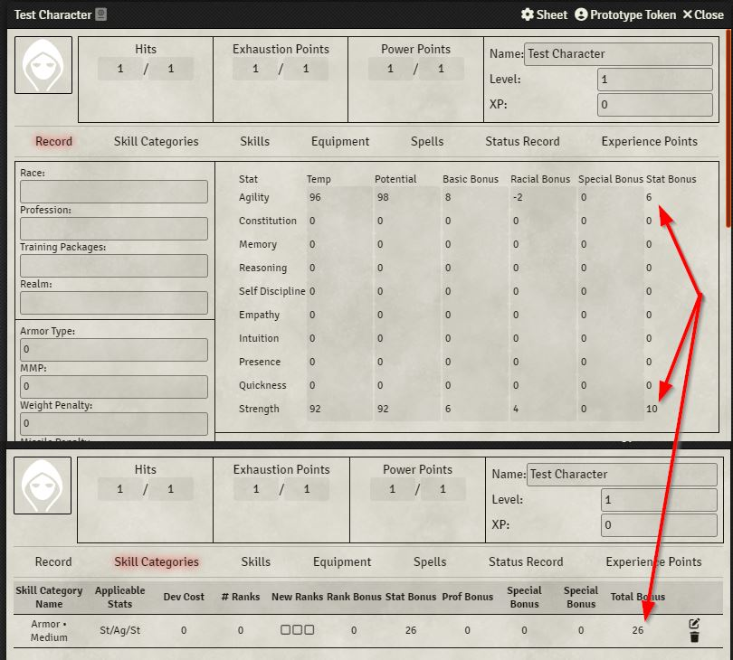

## Creating a Skill
When you create a skill you will be unable to select a skill category as the skill has no owner and Foundry does not know what skill categories are available to it. 

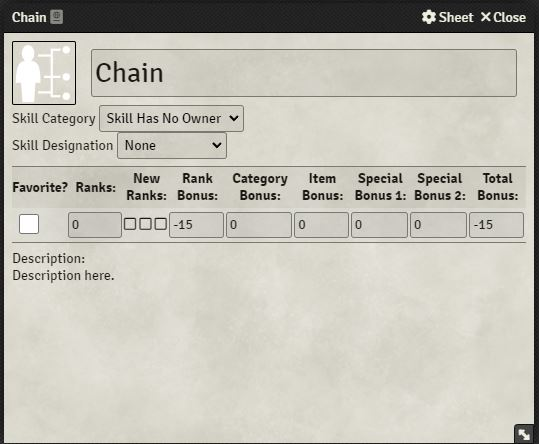

Once you have dragged the Skill onto the character sheet you will be able select a skill category and Foundry will start to apply the Category Bonus. Like Skill Categories; things like Ranks, Rank Bonuses, Items Bonuses and Special Bonuses are manually entered but will be taken into account when the Total bonus is calculated.

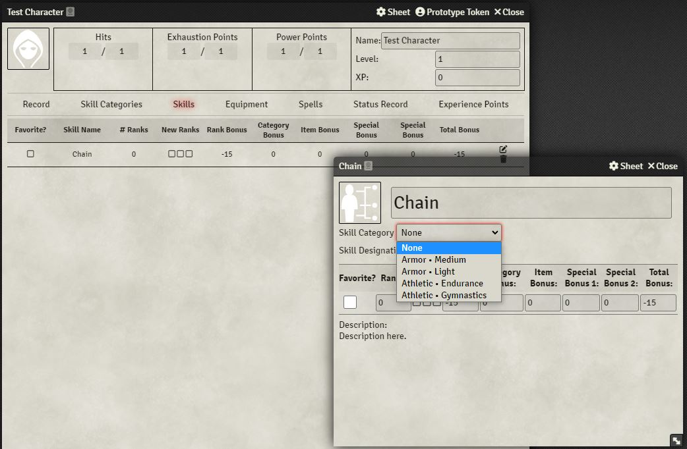

When you select a skill as a favorite you can see it added to the front page of the character sheet for quick reference

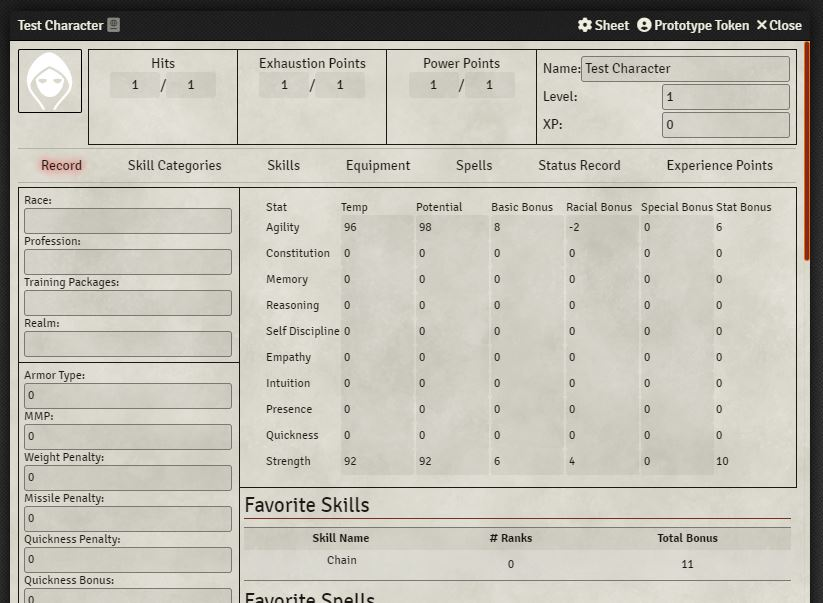

## Adding Items
Items such as mundane Items, Weapons, Armor and Herbs can be created in Foundry and then dragged to the Equipment Screen on the character sheet. Additionally they can be created directly on the sheet if need be. Items to not have any direct functionality yet and appear for record keeping purposes only.

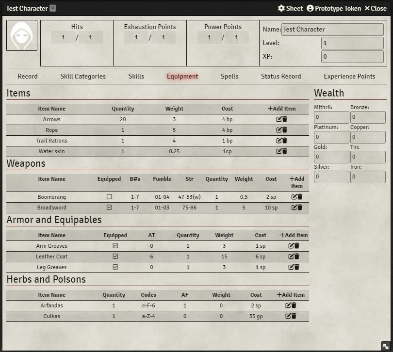

## Adding Spells
Spells can be added to the Spells tab in much the same way that items can. They can be favorited and will appear on the front page of the character sheet. Spells to not have any direct functionality yet and appear for record keeping purposes only.

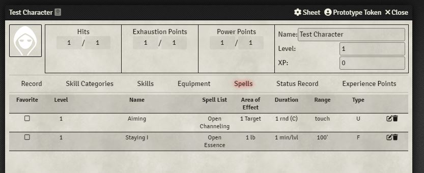